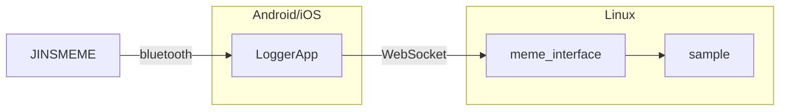

### jinsmeme-sample

JINS MEMEのWebSocketを受けて動くサンプルアプリ

---

#### 構成概略図



---

#### How To Run

##### 前提条件

* JINSMEMEと接続するAndroid/iOSとjinsmeme-sampleを立ち上げるPCが同一ネットワーク上にあること

##### 手順

1. Linux上でdockerコンテナを立ち上げる
   ```bash
   > cd jinsmeme-sample
   > docker compose up -d --build
   ```

2. dockerコンテナに接続し、アプリの起動スクリプトを実行する
   ```bash
   > docker compose exec jinsmeme-sample /bin/bash
   > cd script
   > ./run_app.sh
   ```
   ※`INFO: Application startup complete.`の表示がコンソールにあれば起動している状態となる

3. Android/iOSのLoggerAppを立ち上げ,下記のWebSocketクライアントを追加する
   ```
   Ip Address: <jinsmeme-sampleを立ち上げたPCのIPアドレス>
   Port: 8080
   Data Type: currentData
   ```

4. JINSMEMEをLoggerAppと接続し、3.で作成したWebSocketクライアントを有効化する


停止方法：Linuxのコンソール上で`ctrl-c`をキー入力する
